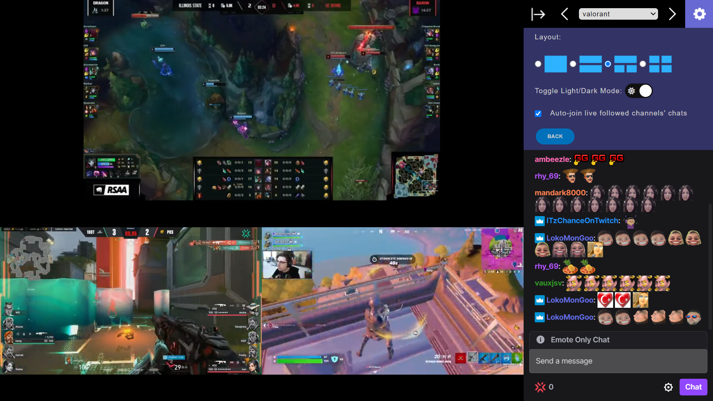

# Twitch Viewer

Twitch Viewer: Alternate way to watch your favourite Twitch streams.


Add streams/chats you want in the options menu. Sign in to your Twitch account to use the auto-join live followed channels' chat feature.

## Built With

- [React.js](https://reactjs.org/)
- [Redux](https://redux.js.org/)

### Components & Libraries

- [React Twitch Embed](https://www.npmjs.com/package/react-twitch-embed)
- [React Twitch Embed Video](https://www.npmjs.com/package/react-twitch-embed-video)
- [React Bootstrap](https://react-bootstrap.github.io/)
- [Twurple](https://twurple.js.org/)

## Installation and Setup

```
$ npm i
```

### Environment Variables

Development app variables are stored in a ".env" file at root.

```
REACT_APP_TWITCH_CLIENT_SECRET=XXXXX
REACT_APP_TWITCH_CLIENT_ID=XXXXX
REACT_APP_TWITCH_CLIENT_REDIRECT=URI
```

Steps on how to obtain app variables are detailed at [Twitch API docs](https://dev.twitch.tv/docs/authentication/register-app)